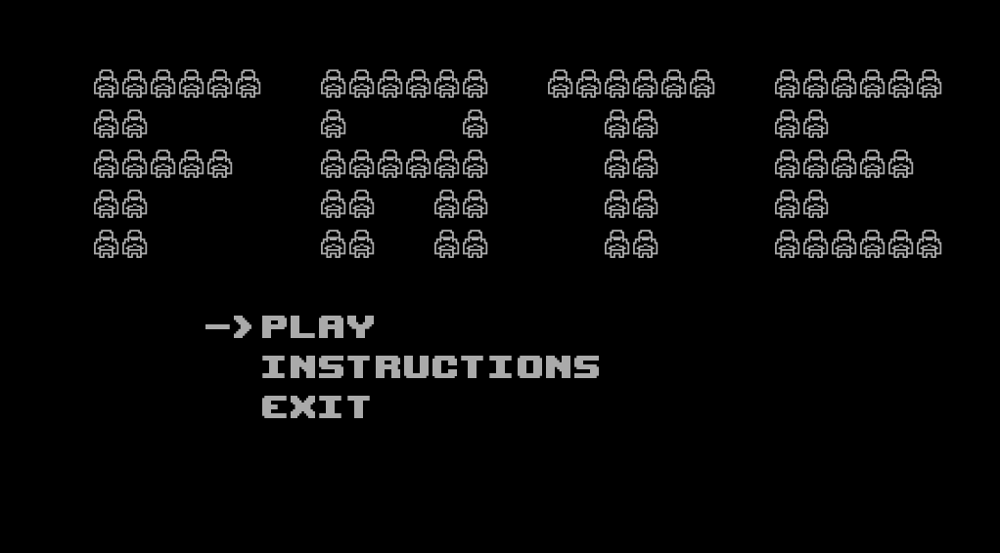
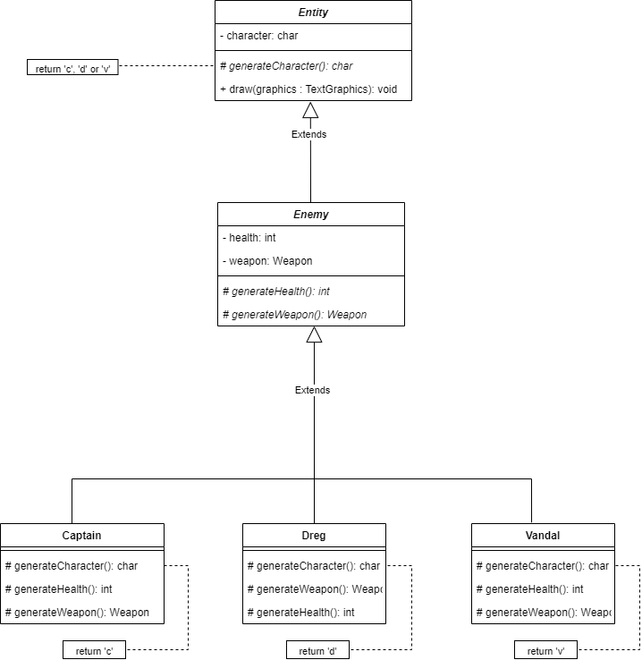

## LDTS_T10_G1002 - FATE

### Game Description

This project consists in a 2D looter shooter game, where the inspirations are Destiny and Pokemon.
The game consists of one player and different monsters, which depend on different levels. The player has 3 types of weapons with their own characteristics, which are used to kill monsters and get to the next level. Monsters can also shoot the player, and depending on which one it is, it may have more health and deal more damage than others.

This project was developed by Eduardo da Silva (up202004999@fe.up.pt), Ian Gomes (up202000707@fe.up.pt) and Igor Diniz (up202000162@fe.up.pt) for LDTS 2021-22.

### Implemented Features

- **Buttons** - Functional and interactive buttons.
- **Keyboard control** - The keyboard inputs are received through the respective events and interpreted according to the current game state.
- **Player control** - The player may move with the keyboard control (keys - a,w,s,d) and shoot his gun when the space-bar is pressed.
- **Animations** - In this game, damage caused by the player or by the enemies is seen in animated forms.
<!-- - **Connected Menus** - The user has the capability of browsing through the different menus including in game ones. (Ex: Main Menu, Instructions, Play, Pause).-->
<!-- - **Collisions detection** - Collisions between different objects are verified. (Ex: Player, Bullet, Enemies, Obstacles).-->
<!-- - **Different levels** - 8 different levels with an increasing difficulty were implemented.-->
<!-- - **Different weapons** - 3 different types of weapons.-->
<!-- - #**Different enemies** - 6 different types of monsters with distinct speed, health and damage.-->

###  **Overview**

  <b><i>Gif 1. Overview of FATE game</i></b>

 
 

  <b><i>Gif 2. Damage caused by the shoots</i></b>

 
 

### Planned Features

- **Different enemies** - 6 different types of monsters with distinct speed, health and damage. Three enemies have been implemented so far.
- **Different weapons** - 3 different types of weapons, with different types of bullets.
- **Collisions detection** - Collisions between different objects should be verified. (Ex: Player, Bullet, Enemies, Obstacles). This feature is almost done, but there are some bugs yet.
- **Different levels** - 8 different levels with an increasing difficulty were implemented.
- **Connected Menus** - The user will have the capability of browsing through the different menus including in game ones. (Ex: Main Menu, Instructions, Play, Pause).

###  **GUI Mockups**
### Menus

  <b><i>Fig 1. Main Menu </i></b>

 
 

  <b><i>Fig 2. Instructions Menu </i></b>

 
 

  <b><i>Fig 3. Pause Menu </i></b>

  

### Enemies

  <b><i>Fig 4. Dreg Enemy </i></b>

  

 
 

  <b><i>Fig 5. Vandal Enemy </i></b>

  

 
 

  <b><i>Fig 6. Captain Enemy </i></b>

  

 
 

### Design

#### Creating new Enemies

**Problem in Context**

As new types of enemies were created, it was necessary to make big changes in the main code of the game, in order to change the behavior of the game according to the enemy that had been created. Thus, many conditionals were needed to effect this behavior change.

**The Pattern**

The factory method pattern was used to replace direct entity construction methods with calls to an enemy factory. This pattern allowed to solve the problem, since it was possible to create enemies without significantly changing the code, through the abstract method generateCharacter.

**Implementation**

The following figure shows how the pattern’s roles were mapped to the application classes.
  

 
  <b><i>Fig 7. Factory Method implementation</i></b>
   

These classes can be found in the following files:

- [Entity](../src/main/java/game/Entity.java)
- [Enemy](../src/main/java/game/enemies/Enemy.java)
- [Captain](../src/main/java/game/enemies/Captain.java)
- [Dreg](../src/main/java/game/enemies/Dreg.java)
- [Vandal](../src/main/java/game/enemies/Vandal.java)

**Consequences**

The use of the Factory Method Pattern in the current design allows the following benefits:

- It's very easy to add new enemies to the game without having to make changes to the main code.
- Removes the need to recreate the same code every time a new enemy is created.

### Known Code Smells and Refactoring suggestions
#### Lots of branching
The 'Level.checkCollisions()', 'Level.moveEnemies()', 'Level.processKey(KeyStroke)' methods are  **Switch Statements**, as it contains lots of branching and, for that, higher complexity. This is problematic because when a new condition is added, we have to find all the switch code and modify it.

A way to improve the code would be to use the Extract method to make the structure of the better, more readable and unique.

### Testing

### Screenshots of Coverage Report

 
  <b><i>Fig 8. General Code coverage screenshot</i></b>
 

 
<b><i>Fig 9. Game Code coverage screenshot</i></b>
 

 
<b><i>Fig 10. Game.enemies Code coverage screenshot</i></b>
 

 
<b><i>Fig 11. Game.weapons Code coverage screenshot</i></b>
 

### Link to mutation testing report
[Mutation tests](../build/reports/pitest/202105302045/index.html)

### Self-evaluation

The work was divided in a mutual way and we all contributed with our best. It helped us to enrich our java and principle/pattern knwoledge, as well as our team work.

- Eduardo da Silva: 33.3%
- Ian Gomes: 33.3%
- Igor Diniz: 33.3%
